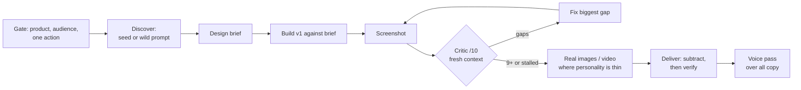

# Design process

Models are capable of amazing creativity, but that creativity gets stifled by how they're
trained. A model builds a design out token by token, and whenever it needs to make a design
decision — what colors to use, how to arrange elements — it fills in the tokens it thinks are
most likely to please everyone. The design ends up repetitive and bland: the ultimate case of
design-by-committee. Great design starts with feeling and aims to create an emotional
response. It bends the rules and delights users with memorable, unexpected choices — exactly
the opposite of making the most predictable choice at every step.

This skill is a design process reimagined for AI agents, loosely inspired by the Double
Diamond: **Discover** new ideas beyond the average by exploring a variety of directions and
writing bold design briefs; **Define** an individual design identity by pushing beyond
familiar patterns and chaining models together; **Deliver** a stunning final result by
polishing away the sloppy rough edges. (Adapted from Anshu Chimala's
["How to turn your AI into a world-class designer"](https://www.lennysnewsletter.com/p/how-to-turn-your-ai-into-a-world),
with the recurring rules from the best-rated public design skills folded into
[references/anti-slop.md](references/anti-slop.md).)

Two rules sit above every step:

- **The brief wins.** Where the user pinned a direction, a font, a palette, an era — follow
  it exactly, even if it appears on a "never by default" list. Redirecting a clear brief
  toward your own taste is failure. The lists apply only where the brief leaves an axis free.
- **A tell is a default reached for without reason, not a pattern that appears.** Judge by
  intent. When unsure whether something is a tell or a decision, treat it as a decision.

## The steps

1. **Gate: what is this, and who is it for?** One line each: the product, the audience, the
   one action the page exists for, the platform, and any brand constraints. If the user gave
   none of that, ask once (`AskUserQuestion`) — a brief you invent is the average brief. The
   subject's industry, materials, and vernacular are where distinctive choices come from.
   In the same message, settle **imagery**: check for a generation route (a key in
   `.env.agents` or fnox, a fal/replicate MCP server, the Codex CLI, built-in image tools;
   see define.md). None found → ask for one, or for real assets (product screenshots,
   photos). Record the answer in the brief; a type-only page is a decision the user makes,
   not a default the agent falls into.

2. **Discover — go broad before deep.** Get variety from *outside* the model. Either seed
   the direction from a random string (String Seed of Thought) or get specific and wild
   with a named inspiration the user brings; when they have none, generate a broad list of
   design languages and let them react. When composition and hierarchy matter more than the
   seeded inspiration itself, mock the screen up with an image model first and build from
   that instead of a text-only brief. Write the chosen direction as a **design brief**
   before any code. Several directions wanted → several briefs, several throwaway variants,
   each isolated. → [references/discover.md](references/discover.md)

3. **Build the first version against the brief.** Commit to the direction hard: real
   typography (chosen for this subject, loaded and verified), one accent used rarely, a
   whole-page shape that isn't hero → three features → CTA → footer, a signature element a
   visitor would remember, every state designed. Check choices against the "never by
   default" table in [references/anti-slop.md](references/anti-slop.md) as you go, not
   afterwards, and run its six-axis self-check before the first screenshot.

4. **Define — the critic loop.** Screenshot the page (desktop and phone, to files).
   Dispatch a **design critic** subagent on the strongest available model, in a fresh
   context with only the screenshots and the intended aesthetic (never the code, never the
   target score). It names the gaps to a studio-level bar — or, better, against real
   reference designs, blind — and scores /10. Fix the biggest gap, re-screenshot, re-run
   with the *same* prompt. The loop is **bounded**: two rounds by default, then stop on the
   first of bar met / a round that changed nothing / budget spent, and show the user. A
   score threshold alone is not an exit; no published loop has ever terminated on one.
   → [references/define.md](references/define.md),
   prompt in [references/critic-prompt.md](references/critic-prompt.md)

5. **Define — real assets.** Any page that carries a visual — a hero, feature art, a
   texture, an illustration slot — gets **generated or real imagery by default**, not
   gradients, shapes, or CSS patterns; agents skip this step unless told, and code-drawn
   decoration is the giveaway. Where motion earns it, video (chroma-keyed loops,
   keyframe-interpolated transitions). Keys live in a gitignored env file or fnox, never in
   source. No route was found at the gate and the user chose type-only → say so in the
   handoff as a known gap, and design so the hero holds on typography and composition
   alone. → [references/define.md](references/define.md)

6. **Deliver — subtract, then verify.** Walk every element asking what breaks if it goes;
   remove glows, gradients, redundant labels, filler copy, custom controls worse than native,
   sections a template put there. Then responsive, dark/light, `accessibility` audit,
   performance, and a real browser screenshot at each breakpoint.
   → [references/deliver.md](references/deliver.md)

7. **Deliver — voice pass.** Run the `writing:voice-profile` skill over every user-visible
   string (headlines, ledes, buttons, empty and error states) so the copy reads in the
   user's register, not the model's default; without a profile, its baseline rules plus
   `writing:humanizer` still apply. → [references/deliver.md](references/deliver.md)

## Which regime

Not every design job earns the full loop. Pick the treatment, not whether to design:

| Job | Do |
|-----|----|
| A component, a settings panel, a doc page, a small restyle | Steps 1–3 + a **single** look: build fully, screenshot desktop and mobile together, fix everything it shows in one batch, confirm once, stop |
| A landing page, a hero screen, anything the user called "generic" or wants to stand out | The full loop, steps 1–6, critic bounded as above |
| The user wants a spread to choose from | Step 2 three or more times in isolated variants, one screenshot each, let them pick, then continue from step 3 on the winner |

## Quick reference

| Symptom | Move |
|---------|------|
| Every run looks the same (purple gradient, hero split) | Seed from a random string, or name a wild inspiration — [discover.md](references/discover.md) |
| "Make it unique/random" didn't help | It can't be random by asking; variety must come from outside the model |
| No idea what direction to take | Broad-list prompt → user reacts → sharpen → build prompt |
| Layout/hierarchy feels off but the direction is right | Mock the screen up with an image model, build from that instead of a text brief — [discover.md](references/discover.md) |
| The agent keeps saying "looks good" about its own work | Critic subagent, fresh context, screenshot only, same prompt every round |
| Critic never satisfied, tokens burning | Cap at 2 rounds first; stop on a stalled score; make the bar concrete (blind pick vs real references) |
| Every non-default choice is the same non-default (Space Grotesk, cream + serif) | A second-order default is still a default; rotate — [anti-slop.md](references/anti-slop.md) |
| Personality comes from CSS gradients and blobs | Generate real images; shaders/3D only in combination with imagery |
| No image-generation key on hand | Ask at the gate, or get real assets from the user; ship type-only only as their stated choice |
| Feels busy, "premium" is missing | Subtraction pass — [deliver.md](references/deliver.md) |
| Looks fine in code review | It isn't done until you've seen the screenshot |

## Done when

- A written brief exists and the shipped design still matches it.
- Strip the product name from the brief: someone could still tell what the page is for.
- The critic scored 9+ (or won the blind comparison) in a fresh context, or the loop hit
  its bound and the user accepted where it stands.
- Nothing on the "never by default" table survives without a reason written in the brief.
- Every visual slot holds generated or real imagery, or the brief records the user's
  type-only decision and the handoff names it as a gap.
- Every remaining element has a job; the copy says only what the product does.
- Screenshots at phone and desktop widths, light and dark, have been looked at, and the
  `accessibility` audit is clean.
- Every user-visible string has been through the voice pass; the copy reads as the user
  would write it, and the voice audit reports no banned words.
