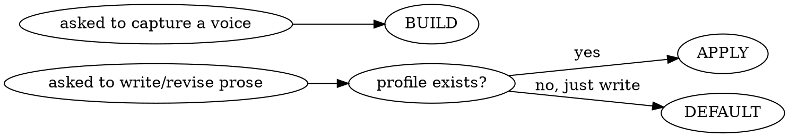

# Voice profile

Match a person's writing voice instead of defaulting to generic AI prose. A *voice profile* is
a markdown file of that person's rules — a Do list, a Don't list, a Banned-words list, and
before/after pairs — built from their own writing. This skill applies an existing profile,
builds a new one, or falls back to baseline expository rules when no profile exists.

This skill is the personal-voice layer. The `humanizer` skill removes generic AI tells (em-dash
overuse, rule of three, AI vocabulary, sycophancy); run it first or alongside. `voice-profile`
adds one person's specific habits and expository concision on top.

## Which mode

## Find the profile

Look in this order; the first hit wins:

1. `$WRITING_VOICE_PROFILE` (a file path)
2. `.claude/voice_profile.md` in the repo
3. `~/.claude/voice_profile.md`

## Apply a profile

1. Read the profile in full. Do not work from a one-line summary — load the actual rules.
2. Draft or revise the prose, following its Do / Don't lists and avoiding its banned words.
3. Audit the draft before returning it:
   `voice_audit.py --profile <profile> <file>` (in `scripts/`) flags banned words with line
   numbers. Read each hit — some banned words have valid uses in context — and fix the real ones.
4. If unsure which paragraph to match, ask the person to point at a sample of their own and say
   "match this".

## Build a profile

Use `references/template.md` as the scaffold. The strongest profiles come from contrast, not
introspection:

1. Gather 2-3 real samples of the person's own writing they are happy with.
2. Draft the same kind of content yourself, then set your draft beside their writing.
3. Name the recurring differences — what they do that you omit (their Do list), what you add
   that they never write (their Don't list and banned words).
4. For each banned word wrap it in backticks under a `## Banned words` heading so the audit
   script can scan it; add the plainer rewrite after a `->`.
5. Capture at least one before/after pair (your draft -> their rewrite). One real pair beats a
   dozen abstract rules.
6. Save the filled profile to one of the lookup paths above. To enforce it automatically, the
   `writing` plugin's `voice-reminder` hook scans `.md`/`.mdx`/`.markdown`/`.tex`/`.txt` edits
   against the discovered profile (opt out with `WRITING_VOICE=false`).

A profile is never finished. When the person rewrites your draft, add the new tic to their Don't
list or banned words.

## Default rules (no profile)

When no profile exists, apply `references/default-rules.md` — baseline expository discipline:
state each point once, thesis-first paragraphs, first person for choices, no contrast framing,
no cleft constructions, no announcing-importance, concrete subjects over inanimate agents. Run
the audit against `default-rules.md` to catch its banned words.

## Common mistakes

- Summarizing the profile instead of reading it. Load the full file; the rules are specific.
- Mass-replacing every banned-word hit. The scanner cannot judge context — read each one.
- Inventing rules from a description of someone's style. Derive rules from real samples.
- Skipping the audit step and claiming the draft matches. Run `voice_audit.py` and fix the hits.
